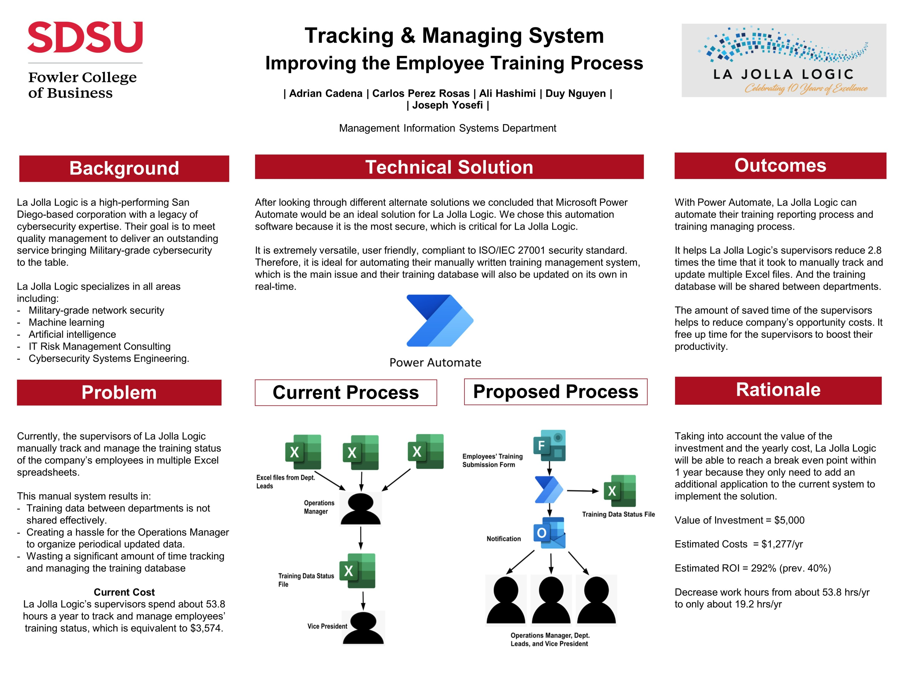

# La Jolla Logic- Training System Analysis  

• Conducted system optimization research and gap analysis as a system analyst consultant. 
• Analyzed the management processes and utilized SCRUM/Agile methodology to design a new effective system using a SaaS application. 
• Improved the ROI from 40% to 292% with the proposed solution. 

Poster of the presentation
